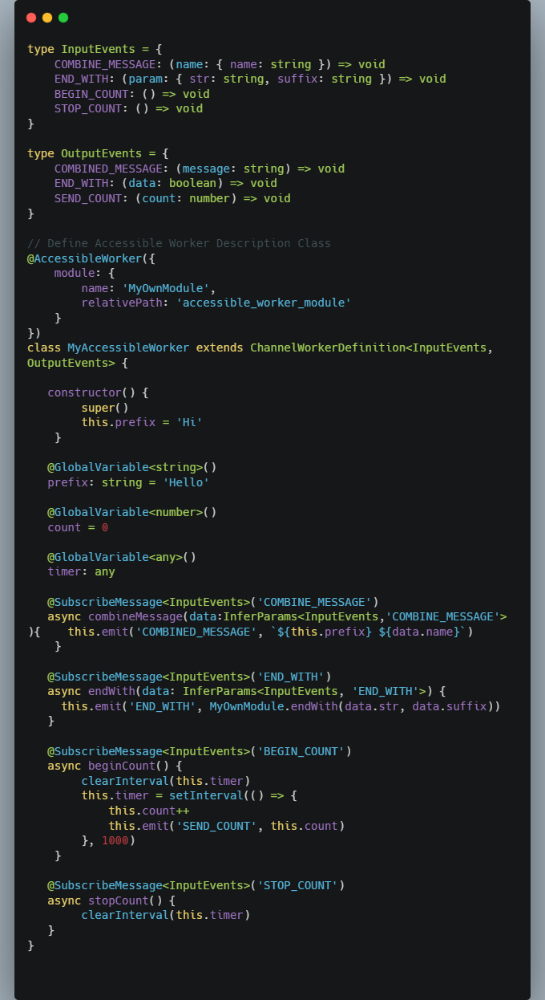
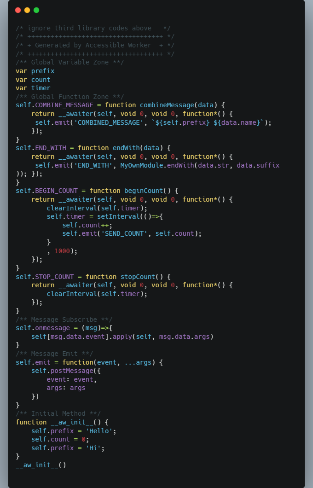
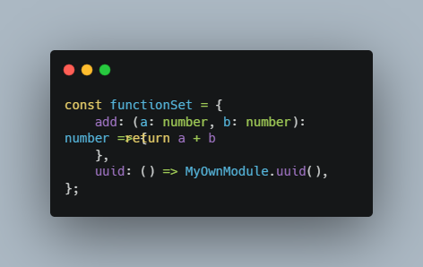
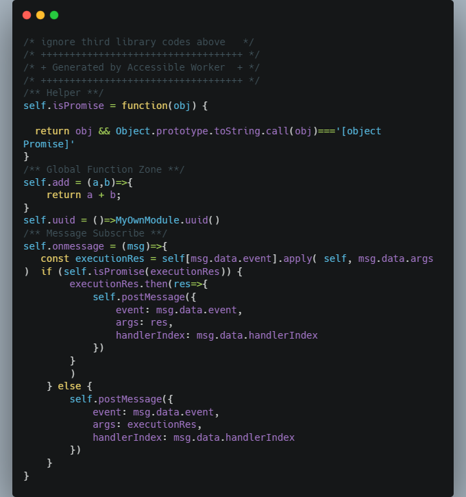

# Accessible Worker （experimental ）
[](https://www.npmjs.com/package/accessible-worker)

accessible-worker aim to make web worker more accessible in TypeScipt and meet oop(Object Oriented Programing) style

## What it does?

- Use TypeScript decorator & acorn compile class into web worker source code.

| Accessible Worker Define                                     | Compiled   Web Worker Souce Codes                            |
| ------------------------------------------------------------ | ------------------------------------------------------------ |
|  |  |
|   | |


## Demo

- A demo is provided, [accessible-worker-demo  ](https://github.com/Okay6/accessible-worker-demo)  /  [online with codesandbox](https://codesandbox.io/p/github/Okay6/accessible-worker-demo)

## Getting Started

1. Install, ```npm install accessible-worker -s``` or ```  yarn add accessible-worker```

2. Update ```tsconfig.json```, for use ```accessible-worker ``` in your project, you shold add ```"experimentalDecorators":true``` option  in ```compilerOptions```, look like this:

   ```json
   {
       ...
       "compilerOptions":{
           ...
           "experimentalDecorators":true
           ...
       }
       
       ...
   }
   ```

## Channel   Worker 

- Channel Worker is designed as Sever-Client style based on event communication

- Define Server I/O events like this:

  ```typescript
  // events for server to listen on 
  type InputEvents = {
      COMBINE_MESSAGE: (name: { name: string }) => void,
      BEGIN_COUNT: () => void
  }
  // events for server to emit
  type OutputEvents = {
      COMBINED_MESSAGE: (message: string) => void,
      SEND_COUNT: (count: number) => void
  }
  ```

  

- Implement your own Channel Worker  ***extends*** ```ChannelWorkerDefinition``` like this:

  ```typescript
  // Define Accessible Worker Description Class
  @AccessibleWorker()
  class MyAccessibleWorker extends ChannelWorkerDefinition<InputEvents, OutputEvents> {
      constructor() {
          super()
          this.prefix = 'Hi'
      }
  
      @GlobalVariable<string>()
      prefix: string = 'Hello'
      
      @GlobalVariable<number>()
      count = 0
      
      @GlobalVariable<any>()
      timer: any
      
     @SubscribeMessage<InputEvents>('COMBINE_MESSAGE')
      async combineMessage(data: InferParams<InputEvents, 'COMBINE_MESSAGE'>) {
          console.log(MyOwnModule.a + MyOwnModule.b)
          this.emit('COMBINED_MESSAGE', `${this.prefix} ${data.name}`)
  
      }
      
      @SubscribeMessage<InputEvents>('BEGIN_COUNT')
      async onCount() {
          clearInterval(this.timer)
          this.count = 0
          this.timer = setInterval(() => {
              this.count++
              this.emit('SEND_COUNT', this.count)
          }, 1000)
  
      }
  
  }
  ```

- Register your own Channel Worker with ```AccessibleWorkerFactory```:

  ```typescript
   // register Channel Worker
   const channelWorkerClient = await AccessibleWorkerFactory.registerChannelWorker<InputEvents, OutputEvents>(MyAccessibleWorker)
  ```

- Now, you can use your own Channel Worker:

  ```typescript
   channelWorkerClient.on('COMBINED_MESSAGE', (msg: string) => {
          console.log(msg)
          // output
          // hi, okay6
    })
   
    channelWorkerClient.on('SEND_COUNT', count => {
          console.log(count)
          // output
          // 1
          // 2
          // 3
          // 4
          // ...
    })
      
    client.emit('COMBINE_MESSAGE', {name: 'okay6'})
    client.emit('BEGIN_COUNT'))
  ```

## Functional  Worker

- Functional Worker will make a function run in web worker by proxy

- Define you own function set:

  ```typescript
  const functionSet = {
      add: (a: number, b: number): number => {
          return a + b
      },
      sub: (a: number, b: number): Promise<number> => Promise.resolve(a - b)
  }
  ```

- Register your own function set with ```AccessibleWorkerFactory```:

  ```typescript
  // register Functional Worker
  const functionalWorker = await AccessibleWorkerFactory.registerFunctionSet(functionSet)
  ```

- Now, you can your own function worker:

  ```typescript
   functionalWorker.sub(3, 1).then(res => {
          console.log(res)
          // output
          // 2
      })
   functionalWorker.add(1, 3).then(res => {
          console.log(res)
          // output
          // 4
   })
  ```

## Use third library

- Cause accessible-worker is ***inline-worker (Javascript codes is dynamicilly created inner Blob)***,  ***Same origin policy***  will block some request like ```import {module} from 'lib'``` and ```importscripts```,  so if we wanna use third library, we have to merge library code into  web worker.

- accessible-worker provides a schema  for integrate third library into yourt own web worker.***(Now,only tested on webpack5)***

- First, define a module which export all you need in one constant like this:

  ```typescript
  // worker_module.ts
  import {v4 as uuidv4} from 'uuid'
  import _ from "lodash";
  export const MyOwnModule = {
      uuid: uuidv4,
      endWith: _.endsWith
  }
  ```

- Then, define your own Channel Worker or  Function Worker:

  ```typescript
  import {
      AccessibleWorker,
      AccessibleWorkerFactory,
      ChannelWorkerDefinition,
      GlobalVariable, InferParams,
      SubscribeMessage
  } from "accessible-worker";
  import {MyOwnModule} from "./worker_module";
  
  
  type InputEvents = {
      IS_END_WITH: (param: {str:string, suffix:string}) => void
  }
  
  type OutputEvents = {
     END_WITH_RES: (res: boolean) => void
  }
  
  @AccessibleWorker({
      module: {
          name: 'MyOwnModule',
          relativePath: 'accessible_worker_module'
      }
  })
  class MyAccessibleWorker extends ChannelWorkerDefinition<InputEvents, OutputEvents> {
      @SubscribeMessage<InputEvents>('IS_END_WITH')
      async combineMessage(data: InferParams<InputEvents, 'IS_END_WITH'>) {
          this.emit('END_WITH_RES', MyOwnModule.endWith(data.str,data.suffix))
      }
  }
  
  const functionSet = {
      uuid: (): string => MyOwnModule.uuid(),
  }
  ```
  
- Register your own channel worker or function worker:

   ```typescript
    // register Channel Worker
    const channelWorkerClient = await AccessibleWorkerFactory.registerChannelWorker<InputEvents, OutputEvents>(MyAccessibleWorker)
    // register Functional Worker
    const functionalWorker = await AccessibleWorkerFactory.registerFunctionSet(functionSet,{
               module: {
                   name: 'MyOwnModule',
                   relativePath: 'accessible_worker_module'
               }
           })
   ```

- You should compile ```worker_module.ts``` into single js file for load, in webpack5, we can do it like this, add a new webpack config:

  ```js
  const TerserPlugin = require("terser-webpack-plugin");
  
  module.exports = {
      entry: {
          "accessible_worker_module": "./project/worker_module.ts",
      },
      experiments: {
          outputModule: true,
      },
      optimization: {
          minimize: true,
          minimizer: [
              new TerserPlugin({
                  extractComments: false
              }),
          ],
      },
      output: {
          publicPath: './dist/',
          filename: '[name].js',
          chunkFilename: '[name].[chunkhash].js',
          library: {
              type: "module"
          }
      },
      resolve: {
          extensions: [".ts", ".js"],
      },
      module: {
          rules: [
              {
                  test: /\.tsx?$/,
                  use: "ts-loader",
                  exclude: "/node-modules/"
              },
          ]
      },
      mode: "production"
  }
  ```

- Add  build script in ```package.json```:

  ```json
  {
    ...
      "scripts": {
         ... 
         "awm": "webpack --config webpack.aw.config.js",
         ...
      }
    ...
  }
  ```
- For compile worker_module.ts once code updated, we can use webpack hook plugin ```hook-shell-script-webpack-plugin``` in ```webpack.config.js```:

  ```js
  module.exports = {
     ...
        plugins: [
          ...
          new HookShellScriptPlugin({
              afterEmit: ['npm run awm']
          })
          ...
      ],
     ...
  }
  ```


## **!!! So far, accessible-worker  is  experimental and only tested on webpack5**


## License

[**Apache License Version 2.0**](https://www.apache.org/licenses/LICENSE-2.0.html)

Copyright (c) 2023-present, HongXiang Li